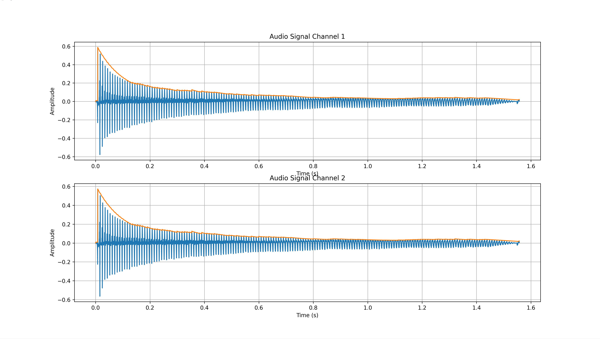
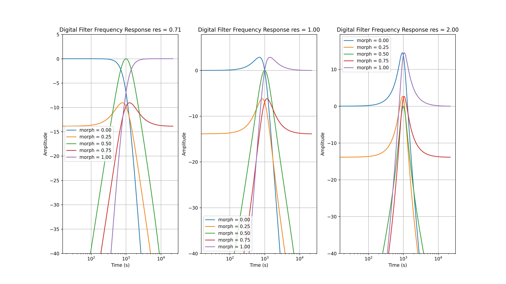

# Design

This folder contains python scripts to run simulations of the auto wah components.

## Installing requirements
To install requirements one has to run the following command

``` bash
pip install -r requirements.txt
```

## Runing simulation

### Envelope Follower

The envelope follower is based off a one-pole filter. There are two main parameters:
- Attack time: it refers to the speed at which the envelope respond to increases in signal level.
- Decay time: it refers to how slowly the envelope returns to its baseline when the signal level decreases.

To run the simulation, one can execute the following command:
```bash
python EnvelopeFollower.py --input_file=<path_to_your_wav_file>
```

The output is a plot of your audio signal with the calculated envelope in superposition as shown below.. One can change the value of the attack or the decay by adding `--attack_time` and `--decay_time` to the above-mentioned command.



### Wah filter

The wah filter is based on a biquad architecture. It performs a coefficient morph between LPF BPF and HPF using the morph parameter. Resonance and center frequency of the filter are also configurable. One can rerun the simulation using the following command:
```bash
python WahFilter.py
```

The following figure shows the the filter response at 1kHz for different morph and resonance values:

